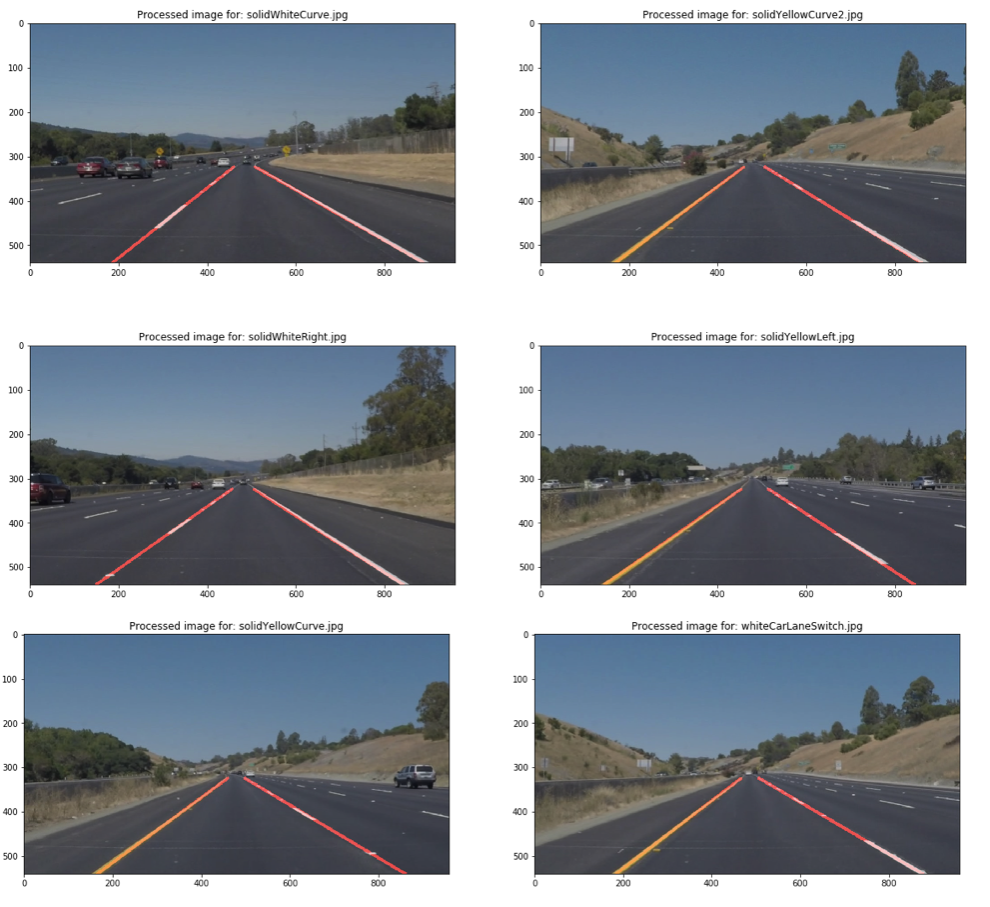

# **Finding Lane Lines on the Road** 

This project is based on [Udacity Finding Lane Lines on the Road](https://github.com/udacity/CarND-LaneLines-P1).

The goal is to find lane lines for images from vehicles. The result could be similar to this:

For more information, you can check [writeup](writeup.md)

